## Nama : Prananda Aditya
## NIM  : 312010130
## Kelas: TI.20,A1
## Matkul : Pemograman Web
## Belajar HTML dasar
## Langkah - Langkah Praktikum
nama saya prananda disini saya akan menjelaskan tentang membuat web dengan HTML
 Pertama siapkan VSCODE dan Browser
.png)
 Kemudian buat file baru dengan nama <b>Lab1_tag-dasar.HTML</b>
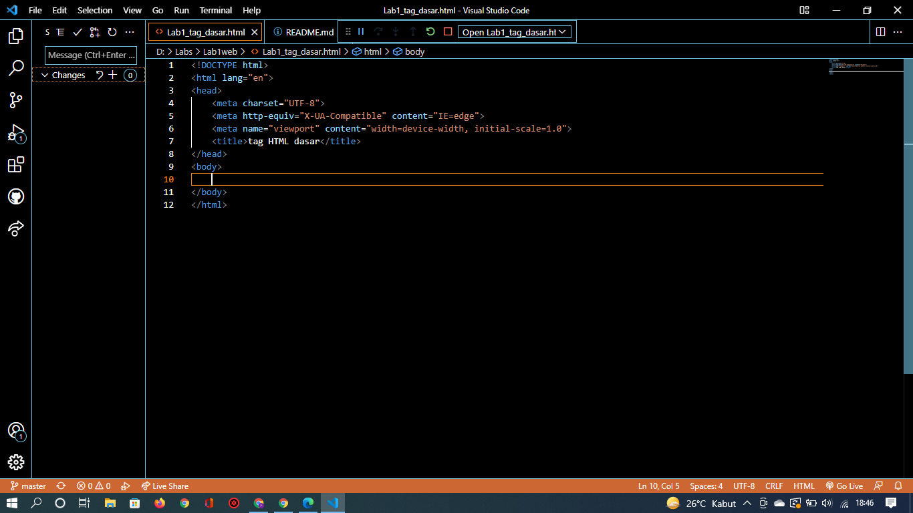
 Selanjutnya buka file tersebut menggunakan browser. Disini saya menggunakan <b>Google Chrome</b>
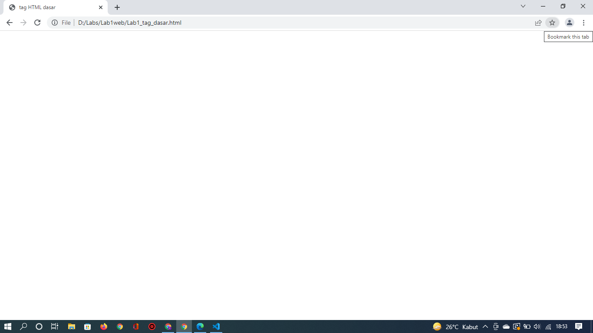

## 1. Membuat Paragraf
Buatlah Paragraf sederhana seperti berikut ini. dan kemudian lihat hasilnya dengan menrefresh pada web browser
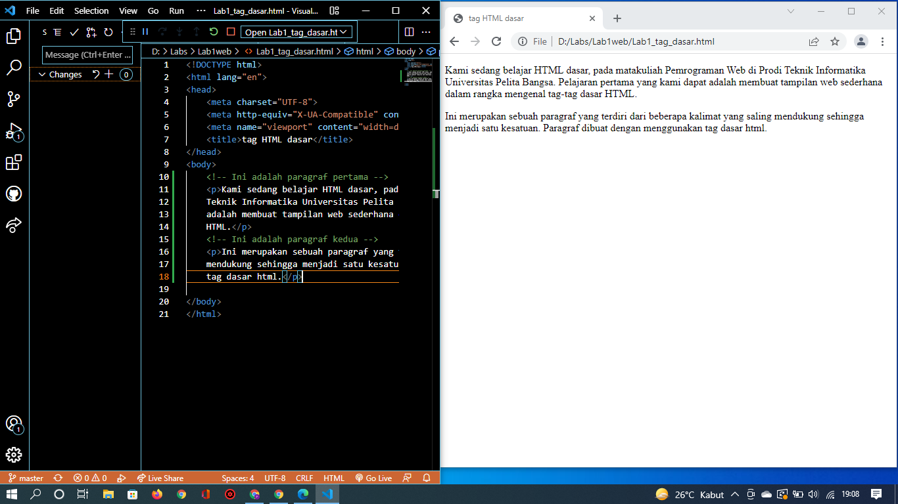
 kemudian atur atribut paragraf seperti berikut dan lihat perubahannya
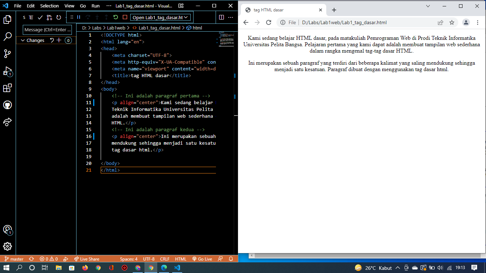
simpan dan refresh web browser untuk melihat perubahannya. selanjutnya untuk mengubah model paragraf nilai atributnya (align = Justify, left, right dan center) untuk melihat perbedaannya

## 2. Menambahkan Judul
judul memiliki 6 level yang berbeda mulai dari h1 sampai h6. kemudian tambahkan judul h1 sebelum paragraf pertama dan tambahkan sub-judul h2 sebelum paragraf ke 2
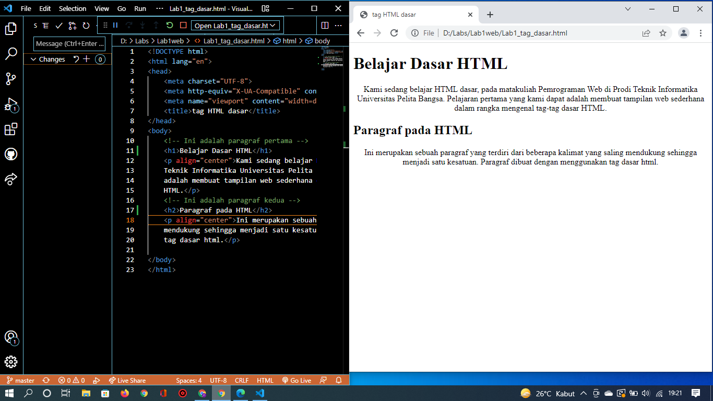
simpan dan lihat perubahannya

## 3. Memformat Teks
Lakukan performatan teks yang ada pada paragraf yang sudah ada sebelumnya, mengacu kepada penjelasan materi pemformatan teks sehingga tampilannya akan berbeda seperti berikut.
 masukan code teks seperti berikut untuk melihat perubahan
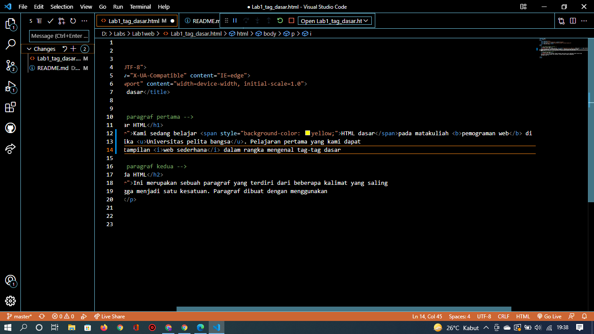
dan hasilnya akan seperti ini
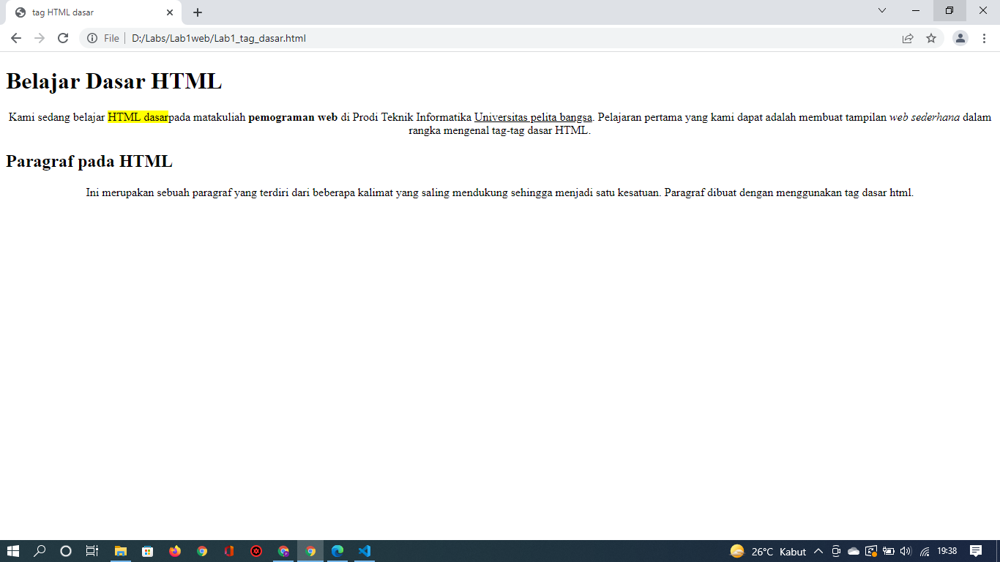

## 4. Menyisipkan gambar
 Untuk menyisipkan gambar, siapkan terlebih dahulu gambar yang ingin dimasukan pada HTML dan sisipkan atau taruh gambar pada satu folder dengan HTML seperti gambar Berikut :

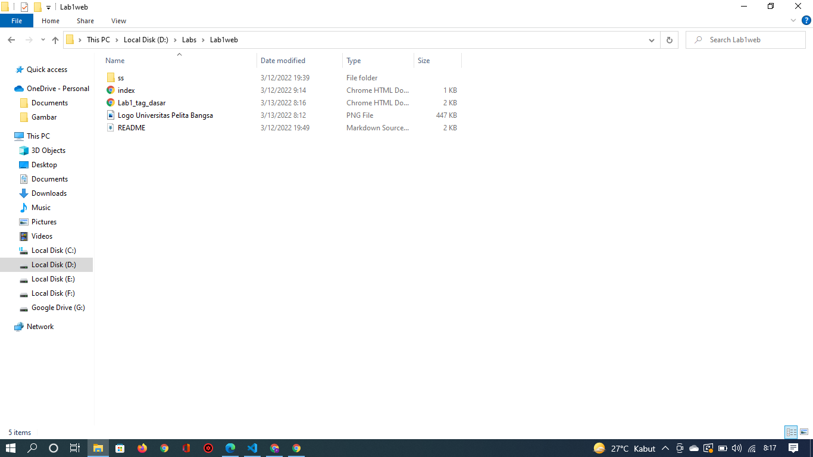

 Kemudian tambahkan tag img setelah paragraf kedua, dengan menambahkan Heading 3 sebelumnya seperti berikut :

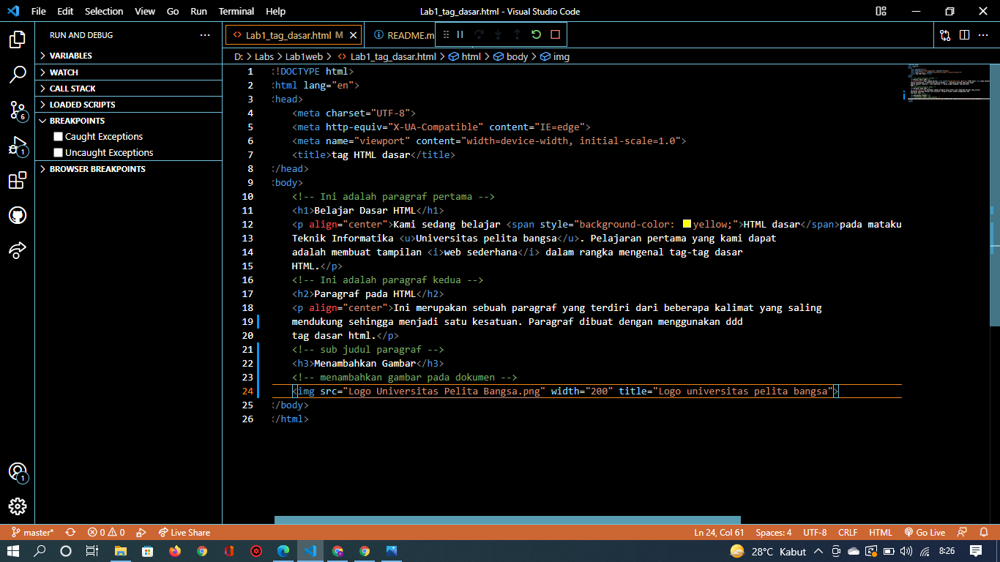
 Gambar akan di tampilkan apa adanya sesuai ukuran aslinya. untuk mengatur ukuran gambar, dapat menggunakan atribut witdh dan height dengan nilai interger yang di sesusaikan seperti contoh di atas. nanti gambar akan seperti berikut inii :
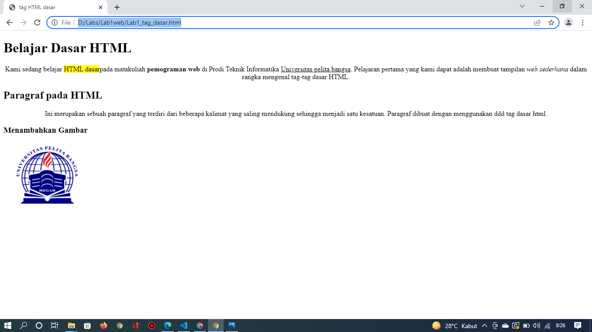

## 5. menambahkan Hyper Links

 Tambahkan Hyperlink pada dokumen sebelum heading 1 seperti gambar berikut :
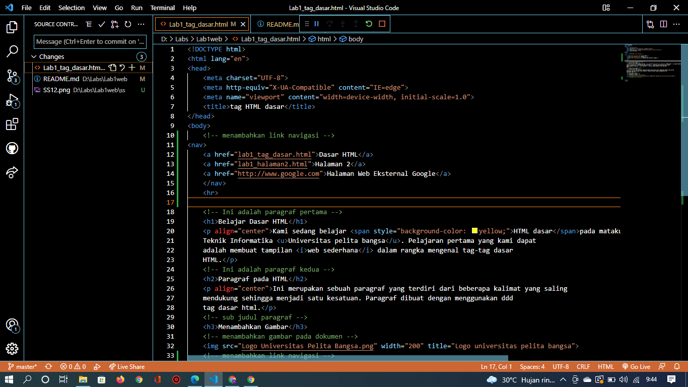

 Nanti hyperlink akan berada di atas seperti gambar berikut :
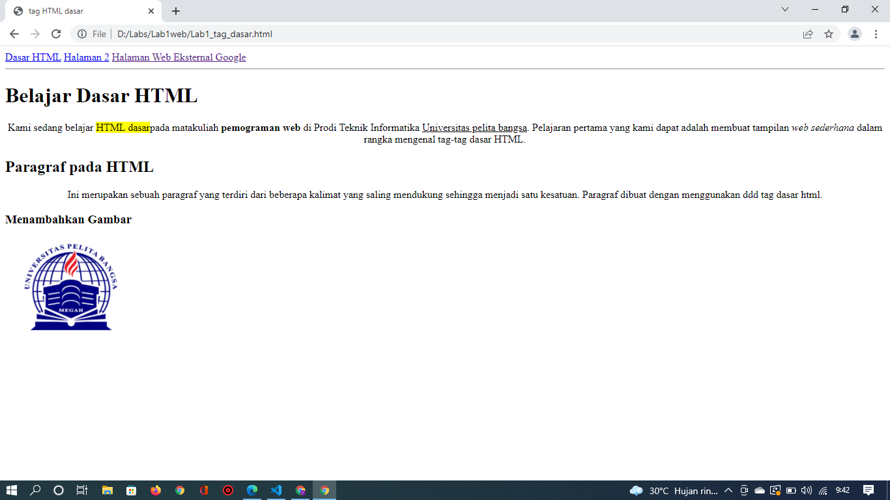
 
 Sekian penjelasan dari saya tentang membuat HTML menggunakan VSCode semoga mudah di mengerti sekian dari saya. TerimaKasih